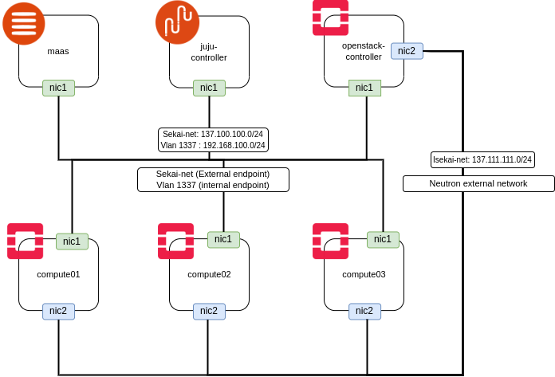
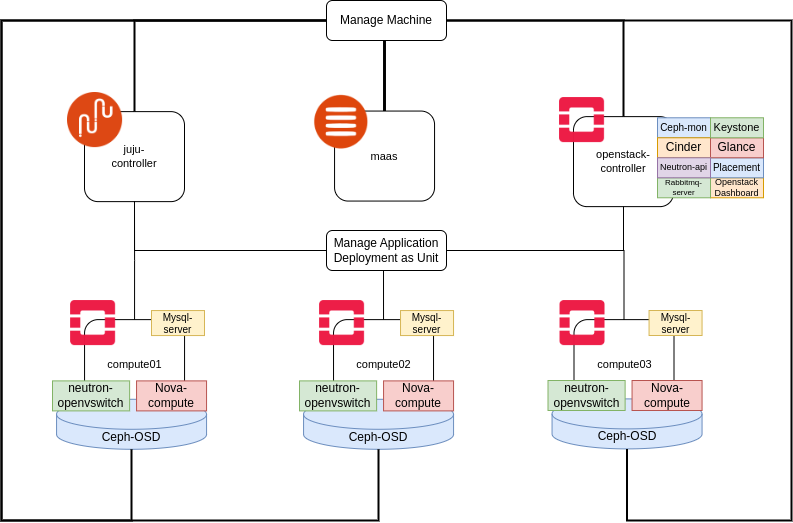

# Juju-maas-openstack
This repo contain python script that i've made to make provision virtual machines for `juju-maas-openstack` scenario in kvm easier.

## Overview

- `Metal as a Service – MAAS` – lets you treat physical servers like virtual machines in the cloud. Rather than having to manage each server individually, MAAS turns your bare metal into an elastic cloud-like resource. [src](https://maas.io/docs)
- `JUJU` – An open source orchestration engine for software operators that enables the deployment, integration and lifecycle management of applications at any scale, on any infrastructure using charms. [src](https://juju.is/)
- A `charm` is an operator – business logic encapsulated in reusable software packages that automate every aspect of an application's life. [src](https://juju.is/)
- `Openstack` – a cloud operating system that controls large pools of compute, storage, and networking resources throughout a datacenter, all managed and provisioned through APIs with common authentication mechanisms. [src](https://www.openstack.org/software/)

So, basically the purpose of this repo is to deploy `openstack` consisting of several components (application) using `juju + charms` and manage the kvm virtual machines using `MAAS`. Openstack component that will deploy are keystone, neutron, nova, cinder, glance, placement, horizon. Then, backend storage for cinder and glance using `ceph` distributed storage.

### Target Installation

| Component | Version |
|-|-|
| Operating System | Ubuntu 20.04 LTS (Focal) |
| Openstack | Yoga |
| Ceph | Quincy |
| MAAS | 3.2.9 |
| Juju | 3.2.3 |

## Network Topology

<details><summary>Network topology</summary>



</details>

## Distribution Application Topology

<details><summary>Application topology</summary>



</details>

## Specs

### Virtual Machines

| VM Name | vCpu | Memory | Storage | External endpoint IP |
|-|-|-|-|-|
| maas | 2 | 4G | 50G | 137.100.100.101 |
| juju-controller | 2 | 4G | 50G | 137.100.100.102 |
| openstack-controller | 6 | 8G | 50G | 137.100.100.103 |
| compute01 | 4 | 8G | 50GB (root)<br>3x25G (OSD) | 137.100.100.104 |
| compute02 | 4 | 8G | 50GB (root)<br>3x25G (OSD) | 137.100.100.105 |
| compute03 | 4 | 8G | 50GB (root)<br>3x25G (OSD) | 137.100.100.106 |

### Testing Environment

> OS: Ubuntu 20.04.6 LTS x86_64<br>Kernel: 5.15.0-91-generic<br>CPU: Intel i5-10300H (8) @ 4.500GHz<br>Memory: 32GiB<br>Storage: SSD NVMe 512GiB

## Prerequisite

1. qemu-kvm (nested enabled)
2. terraform
3. python3-libvirt

## Guide

There are 2 main parts which is provision the infrastructure and deploying applications.

Below are steps to provision all infras

1. [Create libvirt pool](README.md#create-libvirt-pool)
2. [Create libvirt network](script/network/)
3. [Create MAAS VM](script/maas/)
4. [MAAS Managed VMs](script/machines/)

Then to deploy the application follow details guide [here](application-bundle/).

## Create libvirt pool

Run this script if you want to `create new libvirt pool` for this scenario, if want to use `existing pool` you can `skip` this step.

Here are some available options from `manage_pool.py`.

```
./manage_pool.py -h
usage: manage_pool.py [-h] [-c] [-d] [-g] [-f]

Create libvirt pool and download cloudimage

optional arguments:
  -h, --help      show this help message and exit
  -c, --create    Create libvirt pool
  -d, --delete    Delete libvirt pool
  -g, --download  Download cloudimage to pool
  -f, --force     Force delete unempty pool path
```

If you want to create new pool use `-c` options, then new directory will be created based on current directory name with addtion `_pool_images` suffix and that directory will be act as `pool path` for new pool with the same name. Well, the result will be printed by the script.

```
./manage_pool.py -c
Created pool details
Name:	juju-maas-openstack_pool_images
Path:	/some/path/juju-maas-openstack/juju-maas-openstack_pool_images
```

The new pool will be empty, you need to fill it with `ubuntu focal cloudimage`. If you already have it then put it there. If you haven't you can use `-g` options to download latest cloudimage version from ubuntu repo. Then, if you wanna create new pool and download cloudimage you can use `-cg` options.

```
./manage_pool.py -cg
Created pool details
Name:	juju-maas-openstack_pool_images
Path:	/some/path/juju-maas-openstack/juju-maas-openstack_pool_images
File focal-server-cloudimg-amd64.img does not exist. Start download.
focal-server-cloudimg-amd64.img:   1%|#
```

Cloudimage size around 600 MiB and don't worry if the download process was suddenly interrupted because script can continue the incomplete download.

```
./manage_pool.py -g 
Nothing to download
File focal-server-cloudimg-amd64.img is incomplete. Resume download.
focal-server-cloudimg-amd64.img:   4%|####
```

[Next Steps](README.md#guide)

## FAQ (?)

Some questions that probably asked by whoever read this repo.

1. Why not all infras managed by terraform or using libvirt script?
   ```
   Well, initially i want to make all infras manage by script. But, i've skill issue to write some feature in my script so i use terraform to solved it. :)
   ```
