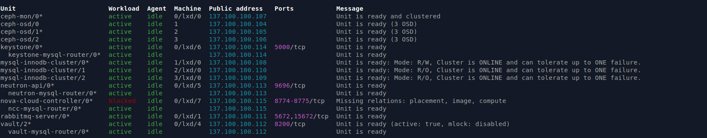

# Deploy Openstack

Well, you can scp this directory that cotain all needed application bundle to maas directly to start deploy juju applications easily.

## Deploy Ceph

Before deploy `openstack` components, first need to deploy `ceph`

### Ceph mon

Deploy `ceph-mon` application using `ceph-mon-bundle.yaml` juju bundle file

```
juju deploy ./ceph-mon-bundle.yaml
```

<details>


</details>

### Ceph osd

Deploy `ceph-osd` application using `ceph-osd-bundle.yaml` juju bundle file

```
juju deploy ./ceph-osd-bundle.yaml
```

<details>


</details>

### Add ceph unit

After deploy application, we need to add `unit` for application. Add `ceph-mon` unit to `openstack-controller` as lxd and `ceph-osd` unit to all compute machine.

```
juju add-unit ceph-mon --to lxd:0
juju add-unit ceph-osd -n 3 --to 1,2,3
```

<details><summary>wait add units</summary>


</details>

Units added but still `blocked` with `missing relations` message.

<details><summary>missing relations</summary>


</details>

Add relation for `ceph-mon` to `ceph-osd`

```
juju integrate ceph-mon:osd ceph-osd:mon
```

<details><summary>wait osd ready</summary>


</details>


<details><summary>all unit active</summary>


</details>

Check ceph cluster

<details><summary>Ceph status OK</summary>


</details>

## Deploy mysql

Deploy `mysql-innodb-cluster` application using `mysql-bundle.yaml` juju bundle file.

```
juju deploy ./mysql-bundle.yaml
```

<details>


</details>

After deploy application, we need to add `unit` for application. Since, minimal unit for `mysql-innodb-cluster` to running is `3`. Then add units to `compute` machine instead of to `openstack-controller` machine as lxd.

```
juju add-unit mysql-innodb-cluster -n 3 --to lxd:1,lxd:2,lxd:3
```

Wait until all units `active`

<details>


</details>

### Sidenote

If in case you shutoff/reboot your hypervisor and all `mysql-innodb-cluster` units blocked like this.

<details>


</details>

You can resolved it by running command below

```
juju run mysql-innodb-cluster/0 reboot-cluster-from-complete-outage
```


## Deploy rabbitmq

Deploy `rabbitmq-server` application using `rabbitmq-bundle.yaml` juju bundle file.

```
juju deploy ./rabbitmq-bundle.yaml
```

<details>


</details>


Add `rabbitmq-server` unit to `openstack-controller` as lxd. Wait until unit `active`

```
juju add-unit rabbitmq-server --to lxd:0
```

<details>


</details>


## Deploy Vault

Deploy `Vault` application using `vault-bundle.yaml` juju bundle file.

```
juju deploy ./vault-bundle.yaml
```

<details>


</details>


Add `vault` unit to `openstack-controller` as lxd and add relation to `mysql-innodb-cluster` and wait until unit `active`

```
juju add-unit vault --to lxd:0
juju integrate vault-mysql-router:db-router mysql-innodb-cluster:db-router
juju integrate vault-mysql-router:shared-db vault:shared-db
```

<details>


</details>

Now, we need to initialized the vault.

First, install vault client

```
sudo snap install vault
```


Initialized the vault
```
// IP Vault unit
export VAULT_ADDR="http://137.100.100.112:8200"

// Init, take note of output
vault operator init -key-shares=5 -key-threshold=3
```

<details><summary>example output</summary>


</details>

Unseal vault using 3 different keys

```
vault operator unseal T82okGEL8b+42gS7gVQWEAMb12wFRQv6q0BfImrKjzh3
vault operator unseal cun8bN3RliYlgAvLlY9rTT1Zw4v7WLhOpiNTGsKapjUo
vault operator unseal /MORxA/rm+2HK+rU2qGlmwXHtbsZ8d9J5BgUqS2ZsflZ
```

Last, authorise the vault charm

```
// Using root token
export VAULT_TOKEN=s.OuYXFKTAvvW1iQsemQpZiD0V

// Create Token
vault token create -ttl=10m
```

<details>


</details>

```
// Using token generate before
juju run vault/leader authorize-charm token=s.yLYHAZg2H6XFgZkTs5pLEqcC
```

Make sure `vault` unit `active`

<details>


</details>

Add relation `vault` to `mysql-innodb-cluster` to enabled TLS.

```
juju run vault/leader generate-root-ca
juju integrate mysql-innodb-cluster:certificates vault:certificates
```

## Deploy Neutron

Deploy `Neutron` application using `neutron-bundle.yaml` juju bundle file and `openvswitch` as neutron plugin `ovs-bundle.yaml`.

```
juju deploy ./neutron-bundle.yaml
juju deploy ./ovs-bundle.yaml
```

<details>


</details>


Add `neutron-api` unit to `openstack-controller` and relations to `mysql-innodb-cluster` and `rabbitmq-server`.

```
juju add-unit neutron-api --to lxd:0

juju integrate neutron-mysql-router:db-router mysql-innodb-cluster:db-router
juju integrate neutron-mysql-router:shared-db neutron-api:shared-db
juju integrate neutron-api:amqp rabbitmq-server:amqp
```

Now, `neutron-api` message status `Missing relations: identity`. We'll fix it later

<details>


</details>

Then add relation from `neutron-api` to `openvswitch` plugin and from `openvswitch` to `rabbitmq-server`

```
juju integrate neutron-api:neutron-plugin-api neutron-openvswitch:neutron-plugin-api

juju integrate neutron-openvswitch:amqp rabbitmq-server:amqp
```

## Deploy Keystone

Deploy `Keystone` application using `keystone-bundle.yaml`.

```
juju deploy ./keystone-bundle.yaml
```

<details>


</details>

Add `keystone` unit and relation to `mysql-innodb-cluster`.

```
juju add-unit keystone --to lxd:0

juju integrate keystone-mysql-router:db-router mysql-innodb-cluster:db-router
juju integrate keystone-mysql-router:shared-db keystone:shared-db
```
Add relation to `neutron-api` to fix `missing: identity` and relation to `vault`

```
juju integrate keystone:identity-service neutron-api:identity-service
juju integrate neutron-api:certificates vault:certificates
```

Now, all unit are `active`.

<details>


</details>


## Deploy Nova Cloud Controller

Deploy `nova-cloud-controller` application using `ncc-bundle.yaml`.

```
juju deploy ./ncc-bundle.yaml
```

Add `nova-cloud-controller` unit, then add relation to `mysql-innodb-cluster` database and `rabbitmq-server` messaging.

```
juju add-unit nova-cloud-controller --to lxd:0

juju integrate ncc-mysql-router:db-router mysql-innodb-cluster:db-router
juju integrate ncc-mysql-router:shared-db nova-cloud-controller:shared-db
juju integrate nova-cloud-controller:amqp rabbitmq-server:amqp
```

And add relation to `keystone`, `neutron` and `vault`

```
juju integrate nova-cloud-controller:identity-service keystone:identity-service
juju integrate nova-cloud-controller:neutron-api neutron-api:neutron-api
juju integrate nova-cloud-controller:certificates vault:certificates
```

Still missing some relations, we'll fix later.

<details>


</details>

## Deploy Nova-compute

Deploy `nova-compute` application using `nova-compute-bundle.yaml`.

```
juju deploy ./nova-compute-bundle.yaml
```

Add unit to machine

```
juju add-unit nova-compute -n 3 --to 1,2,3
```

Add relations to `ceph-mon`, `nova-cloud-controller`, `rabbitmq-server` and `openvswitch`.

```
juju integrate ceph-mon:client nova-compute:ceph
juju integrate nova-cloud-controller:cloud-compute nova-compute:cloud-compute
juju integrate rabbitmq-server:amqp nova-compute:amqp
juju integrate nova-compute:neutron-plugin neutron-openvswitch:neutron-plugin
```

Still missing some relations, we'll fix later.

<details>


</details>

## Deploy Placement

Deploy `placement` application using `placement-bundle.yaml`.

```
juju deploy ./placement-bundle.yaml
```

Add unit to to `openstack-controller` as lxd and relations to `database`, `messaging`, `keystone`, `nova-cloud-controller` and `vault`

```
juju add-unit placement --to lxd:0

juju integrate placement-mysql-router:db-router mysql-innodb-cluster:db-router
juju integrate placement-mysql-router:shared-db placement:shared-db
juju integrate placement:identity-service keystone:identity-service
juju integrate placement:placement nova-cloud-controller:placement
juju integrate placement:certificates vault:certificates
```

Still missing some relations, we'll fix later.

<details>


</details>

## Deploy Glance

Deploy `glance` application using `glance-bundle.yaml`.

Deploy bundle
```
juju deploy ./glance-bundle.yaml
```

Add unit to `openstack-controller` as lxd and relation to `database`, `ceph-mon`, `nova`, `keystone` and `vault`

```
juju add-unit glance --to lxd:0

juju integrate glance-mysql-router:db-router mysql-innodb-cluster:db-router
juju integrate glance-mysql-router:shared-db glance:shared-db

juju integrate ceph-mon:client glance:ceph

juju integrate glance:image-service nova-cloud-controller:image-service
juju integrate glance:image-service nova-compute:image-service
juju integrate glance:identity-service keystone:identity-service

juju integrate glance:certificates vault:certificates
```

Now, all units is `active` and `no missing relations`.

<details>


</details>

## Deploy Cinder

Deploy `cinder` application using `cinder-bundle.yaml`.

Deploy bundle
```
juju deploy ./cinder-bundle.yaml
```

Add `cinder` unit to `openstack-controller` as lxd
and relation to `database`, `ceph-mon`, `nova`, `keystone`, `image` and `vault`

```
juju add-unit cinder --to lxd:0

juju integrate cinder-mysql-router:db-router mysql-innodb-cluster:db-router
juju integrate cinder-mysql-router:shared-db cinder:shared-db
juju integrate cinder:amqp rabbitmq-server:amqp

juju integrate cinder:cinder-volume-service nova-cloud-controller:cinder-volume-service
juju integrate cinder:identity-service keystone:identity-service
juju integrate cinder:image-service glance:image-service
juju integrate cinder:certificates vault:certificates
```

<details>


</details>

Last, add `cinder-ceph` relations to `ceph` for creating new pool to use by `cinder`.

```
// Cinder-ceph to create new pool in ceph
juju integrate cinder-ceph:storage-backend cinder:storage-backend
juju integrate cinder-ceph:ceph ceph-mon:client
juju integrate cinder-ceph:ceph-access nova-compute:ceph-access
```

<details>


</details>

## Deploy Cinder

Last, we will deploy `openstack-dashboard` application using `dashboard-bundle.yaml`.

Deploy bundle
```
juju deploy ./dashboard-bundle.yaml
```

Add `openstack-dashboard` unit to `openstack-controller` as lxd
and relation to `database`, `keystone`, and `vault`

```
juju add-unit openstack-dashboard --to lxd:0

juju integrate dashboard-mysql-router:db-router mysql-innodb-cluster:db-router
juju integrate dashboard-mysql-router:shared-db openstack-dashboard:shared-db

juju integrate openstack-dashboard:identity-service keystone:identity-service
juju integrate openstack-dashboard:certificates vault:certificates
```

Now, all openstack components already installed and running

<details>


</details>


## Access Dashboard

Get IP address Openstack Dashboard and Get password admin for login

```
juju status --format=yaml openstack-dashboard | grep public-address | awk '{print $2}' | head -1

juju run keystone/leader get-admin-password
```

<details><summary>login page</summary>


</details>

<details><summary>home page</summary>


</details>

If get some dns error, just add new dns domain in maas. Use same record name just adjust the ip address.

<details>


</details>


<details>


</details>


<details>


</details>

<br>
That's it!

<br>

Next step is operational openstack, you can access [here](https://docs.openstack.org/project-deploy-guide/charm-deployment-guide/latest/configure-openstack.html)