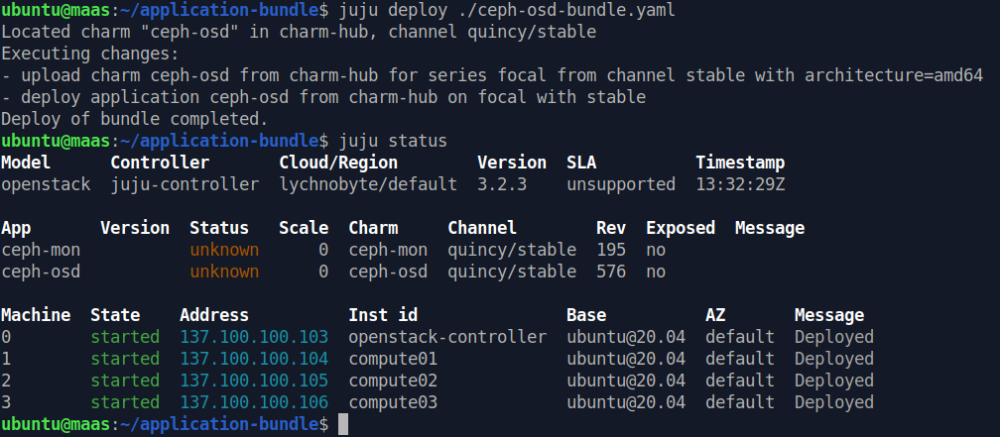
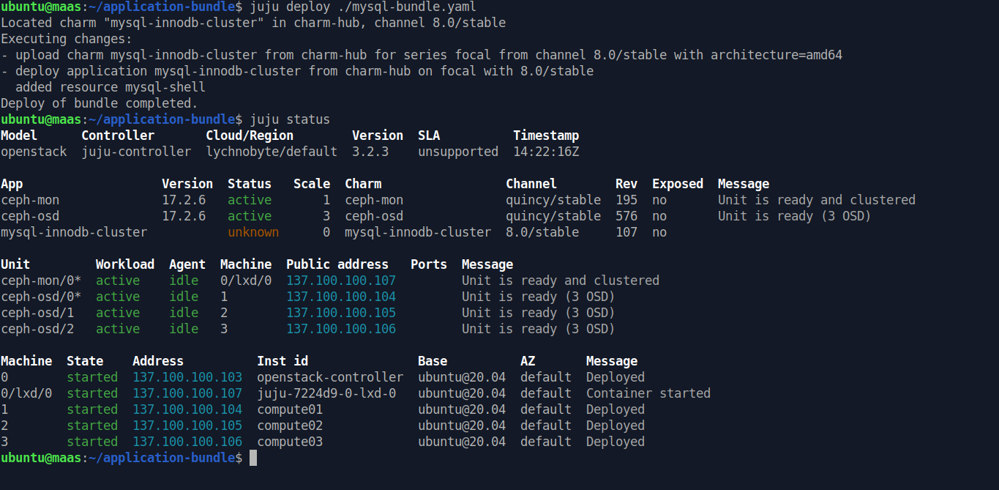

# Deploy Openstack

Well, you can scp this directory that cotain all needed application bundle to maas directly to start deploy juju applications easily.

## Deploy Ceph

Before deploy `openstack` components, first need to deploy `ceph`

### Ceph mon

Deploy `ceph-mon` application using `ceph-mon-bundle.yaml` juju bundle file

```
juju deploy ./ceph-mon-bundle.yaml
```

<details>


</details>

### Ceph osd

Deploy `ceph-osd` application using `ceph-osd-bundle.yaml` juju bundle file

```
juju deploy ./ceph-osd-bundle.yaml
```

<details>


</details>

### Add ceph unit

After deploy application, we need to add `unit` for application. Add `ceph-mon` unit to `openstack-controller` as lxd and `ceph-osd` unit to all compute machine.

```
juju add-unit ceph-mon --to lxd:0
juju add-unit ceph-osd -n 3 --to 1,2,3
```

<details><summary>wait add units</summary>


</details>

Units added but still `blocked` with `missing relations` message.

<details><summary>missing relations</summary>


</details>

Add relation for `ceph-mon` to `ceph-osd`

```
juju add-relation ceph-mon:osd ceph-osd:mon
```

<details><summary>wait osd ready</summary>


</details>


<details><summary>all unit active</summary>


</details>

Check ceph cluster

<details><summary>Ceph status OK</summary>


</details>

## Deploy mysql

Deploy `mysql-innodb-cluster` application using `mysql-bundle.yaml` juju bundle file.

```
juju deploy ./mysql-bundle.yaml
```

<details>


</details>

After deploy application, we need to add `unit` for application. Since, minimal unit for `mysql-innodb-cluster` to running is `3`. Then add units to `compute` machine instead of to `openstack-controller` machine as lxd.

```
juju add-unit mysql-innodb-cluster -n 3 --to lxd:1,lxd:2,lxd:3
```

Wait until all units `active`

<details>


</details>

### Sidenote

If in case you shutoff/reboot your hypervisor and all `mysql-innodb-cluster` units blocked like this.

<details>


</details>

You can resolved it by running command below

```
juju run mysql-innodb-cluster/0 reboot-cluster-from-complete-outage
```


## Deploy rabbitmq

Deploy `rabbitmq-server` application using `rabbitmq-bundle.yaml` juju bundle file.

```
juju deploy ./rabbitmq-bundle.yaml
```

<details>


</details>


Add `rabbitmq-server` unit to `openstack-controller` as lxd. Wait until unit `active`

```
juju add-unit rabbitmq-server --to lxd:0
```

<details>


</details>
