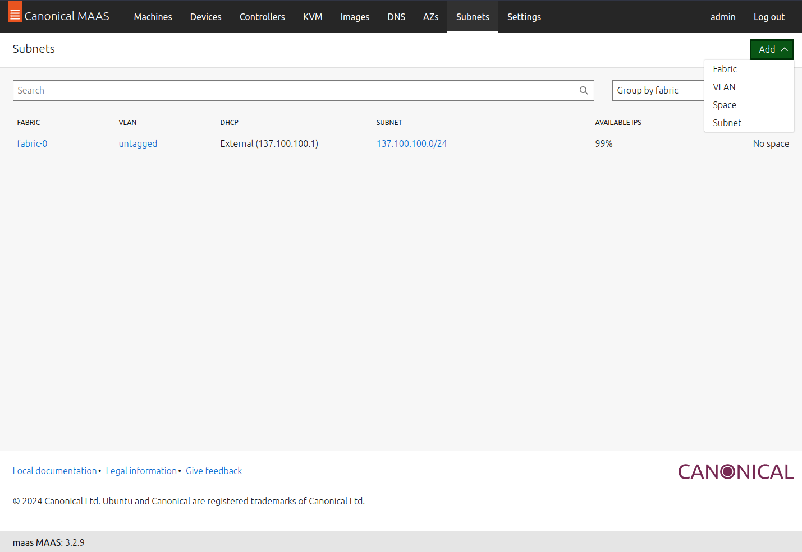
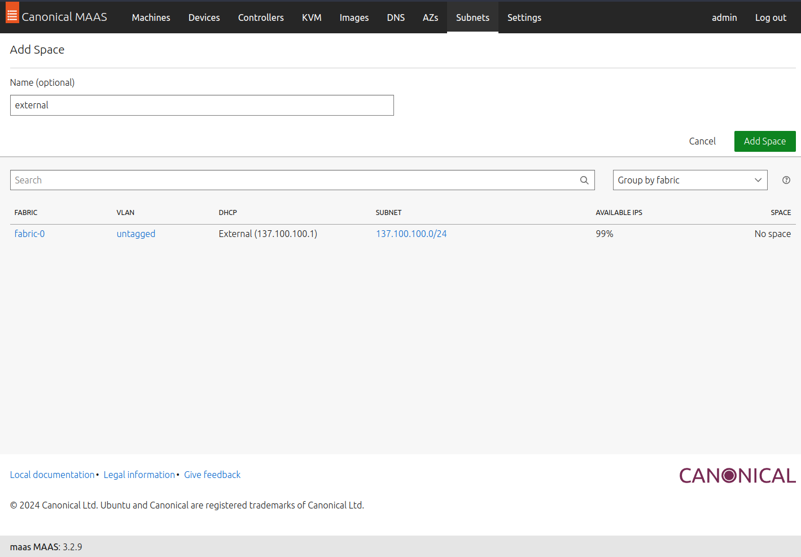
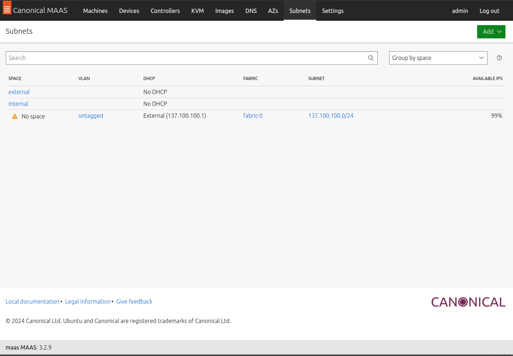
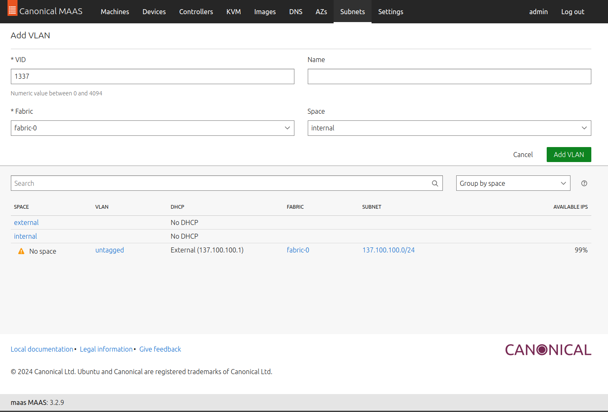
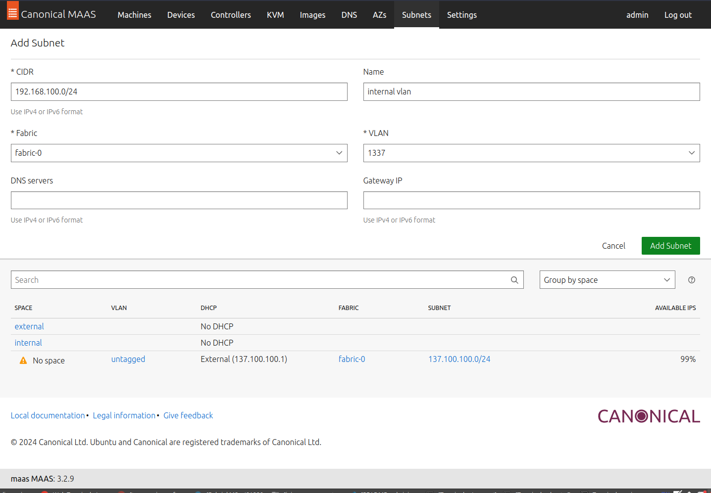
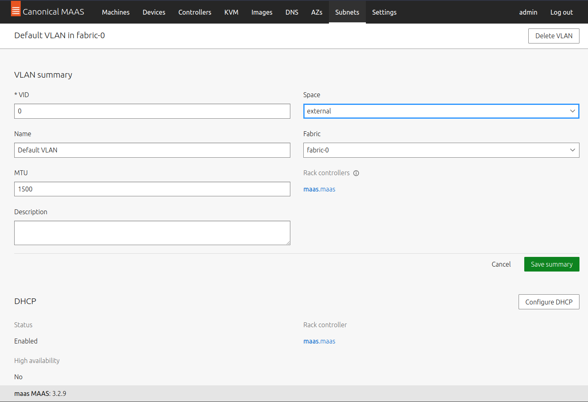
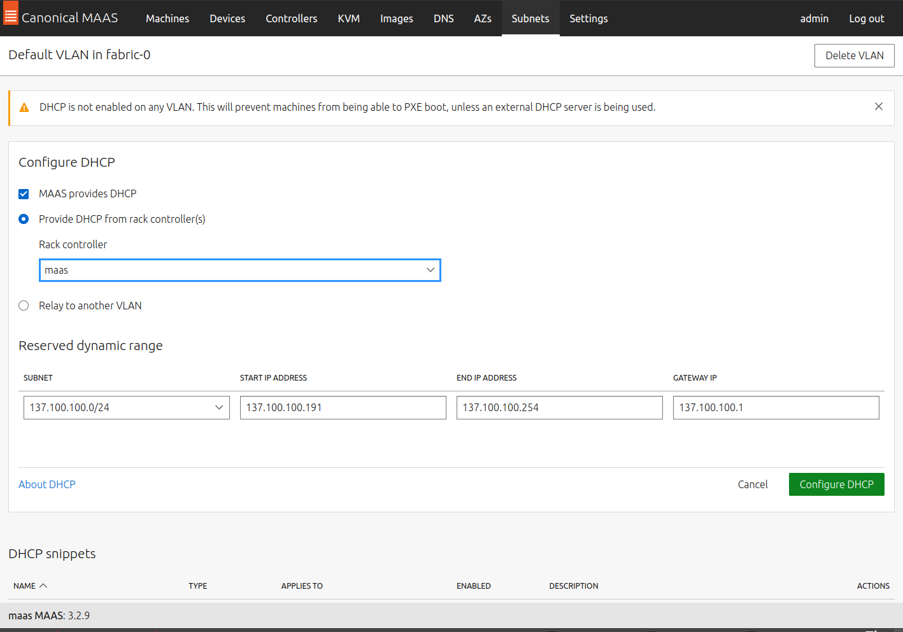
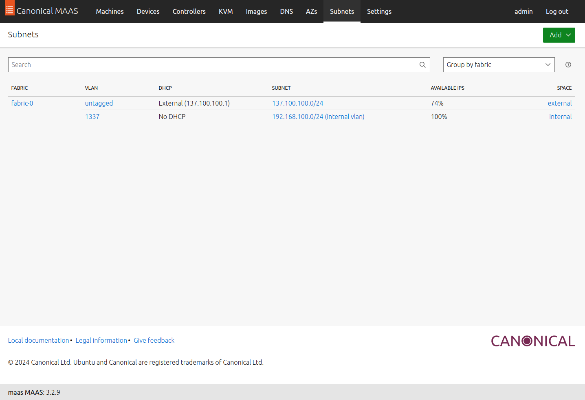
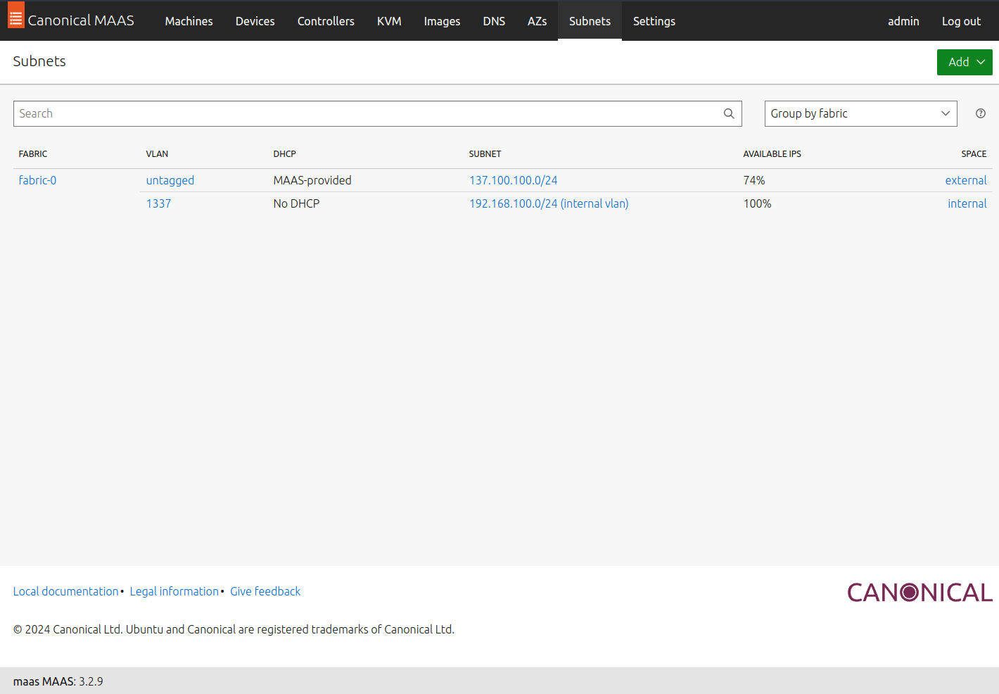
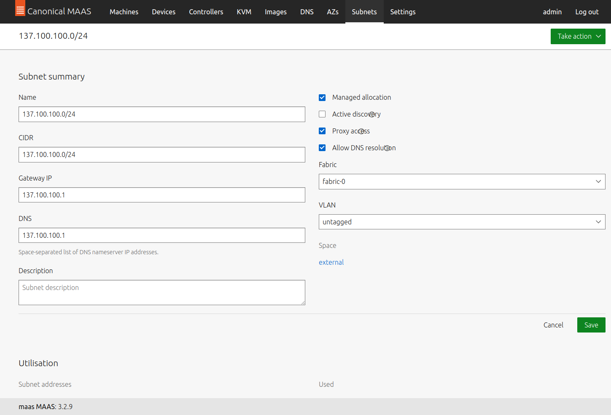

# Setup Network MAAS

## Create space

Create 2 space "external" and "internal".

Add `space` menu

Add `external` space

Add `internal` space

To see result choose group by space

## Create vlan

Create vlan id 1337, using `fabric-0` and `internal` space

## Create subnet

Create subnet for vlan we created before

## Config DHCP

Need to active DHCP server for PXE boot from fabric-0

Click `untagged` vlan. Then, on vlan summary `edit` change space to `external`

Click configure DHCP

Back to subnets tab. On DHCP column maas still detect DHCP from `External` but it should be `MAAS-provided`

At this point, need to recreate network using `manage_network.py` script. Then, `virsh destroy maas` and `virsh start maas` to fix it

Now, fixed

Add dns to subnet untagged vlan

Next step to provision machine and commision

[Next Step](../machines/)