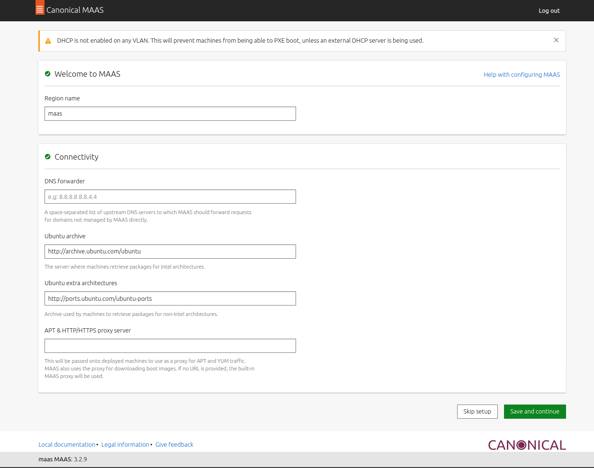
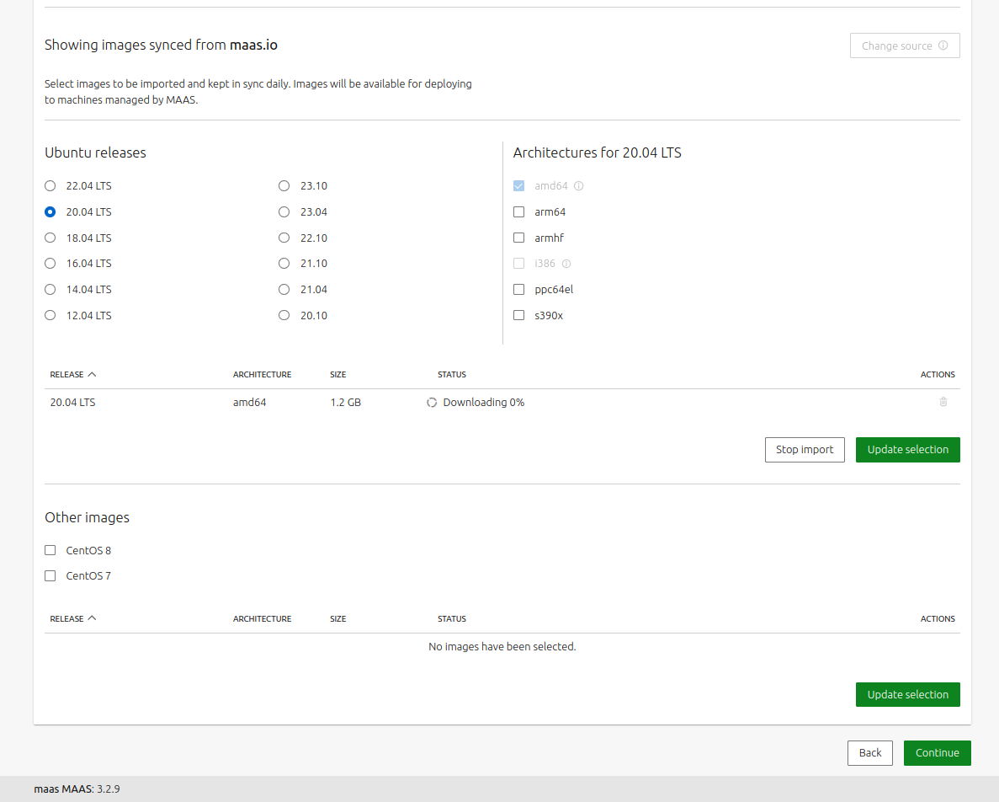
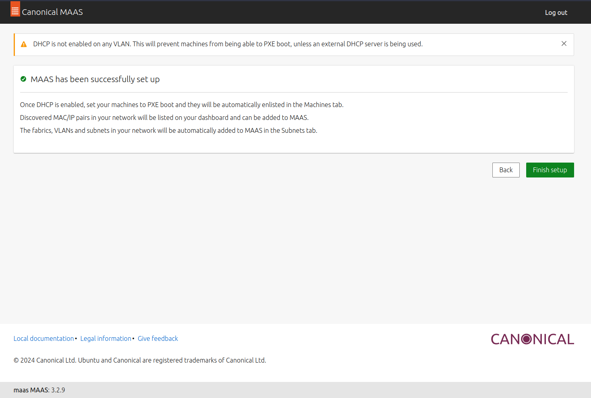
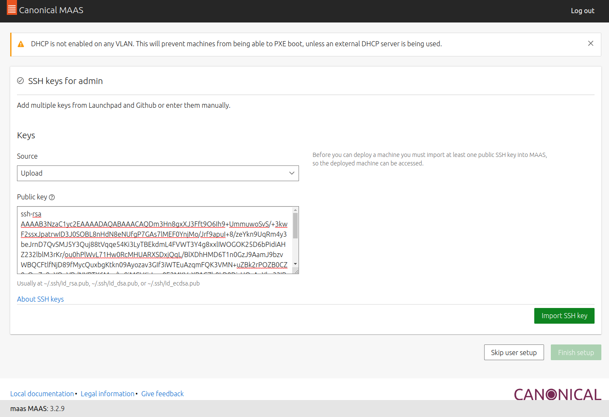

# Setup MAAS

All command below exec as root

## Ssh config for maas later

```
cat << 'EOF' > $HOME/.ssh/config
# Global Config
Host *
  User ubuntu
  StrictHostKeyChecking no
  UserKnownHostsFile /dev/null
  ServerAliveInterval 10
  TCPKeepAlive yes
  LogLevel ERROR
# Global Config
EOF
```

## Install maas version 3.2.9

```
## Add repository
apt-add-repository ppa:maas/3.2

## Install maas packages
apt-get -y install maas \
maas-region-controller \
maas-rack-controller

## Disable automatic updates
apt-mark hold maas \
maas-region-controller \
maas-rack-controller postgresql-12
```

## Temporary statistic file PostgreSQL

```
bash -c cat << 'EOF' > /etc/tmpfiles.d/postgresql-part.conf
## Directory for PostgreSQL temp stat files
d /run/postgresql/10-main.pg_stat_tmp 0700 postgres postgres - -
EOF

systemd-tmpfiles --create /etc/tmpfiles.d/postgresql-part.conf
```

## Change postgres max connection

```
## Exec as postgres user
su - postgres

## Set max connection ke 10000
sed -i 's/max_connections = 100/max_connections = 10000/' /etc/postgresql/12/main/postgresql.conf

## Exec as root, Restart postgresql
systemctl restart postgresql@12-main
```

## Add private key from laptop to maas homedir

This is to give maas access to libvirt for commissioning machine

```
## Exec as root from maas vm

chsh -s /bin/bash maas
su - maas
mkdir -p .ssh/

## Exec from laptop
scp ~/.ssh/id_rsa ubuntu@137.100.100.101:~/

## Exec as root from maas vm
mv /home/ubuntu/id_rsa /var/lib/maas/.ssh/id_rsa
chown maas:maas /var/lib/maas/.ssh/id_rsa
```

## Create maas admin user

```
maas createadmin
Username: admin
Password: admin
Again: admin
Email: admin@maas 
Import SSH keys [] (lp:user-id or gh:user-id): // left empty
```

## Login dashboard maas

Access dashboard from browser and login with user we created before.

[dashboard](http://137.100.100.101:5240/)


## Basic Setup
After login, left all with default value then choose `save and continue`

<details>



</details>

Then, choose amd64 and wait download finish and choose continue

<details>


</details>

Finish setup

<details>


</details>

## SSH keys for admin

```
## Exec from maas vm
ssh-keygen -t rsa -b 4096
```

Copy generated pubkey to maas dashboard, then choose `Import SSH key` and `Finish Setup`

```
cat .ssh/id_rsa.pub 
```

<details>


</details>

Next step is setup the maas network

[Next Step](setup-maas-network.md)