# Commisioning machine in maas

## Adding machines to maas

Open maas dashboard, go to tab machines. Add hardware > Machine

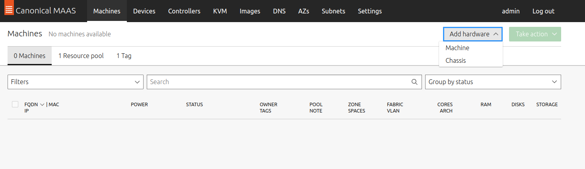

First, we will add `juju-controller` machine. Fill `MAC address` and `Virsh VM ID` from the output of previous step. The rest just follow the screenshot below. Then choose `Save machine`

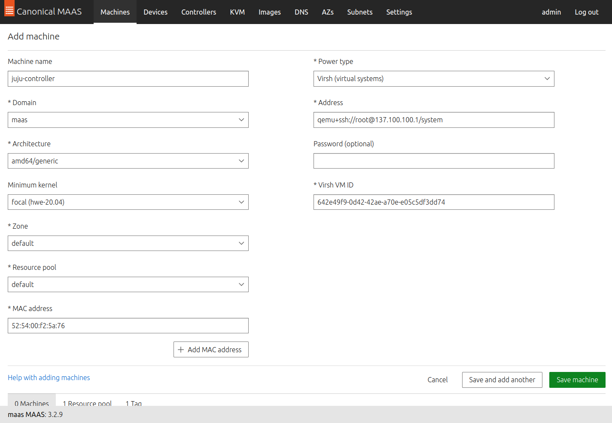

Waiting commisioning process (+- 10 mins)

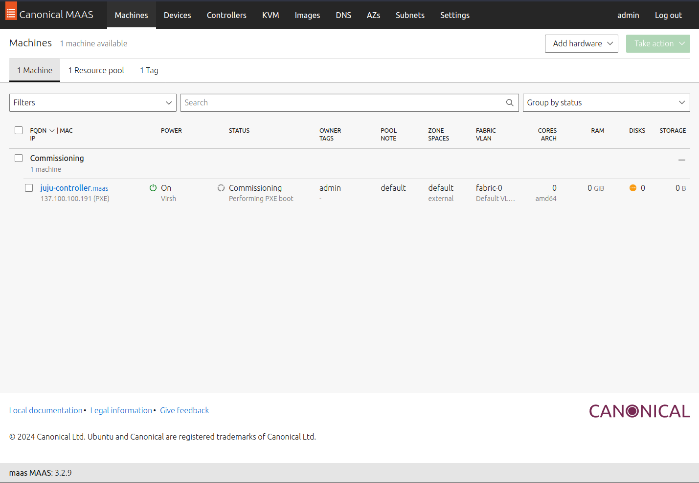

Make sure, now the machine is `ready`

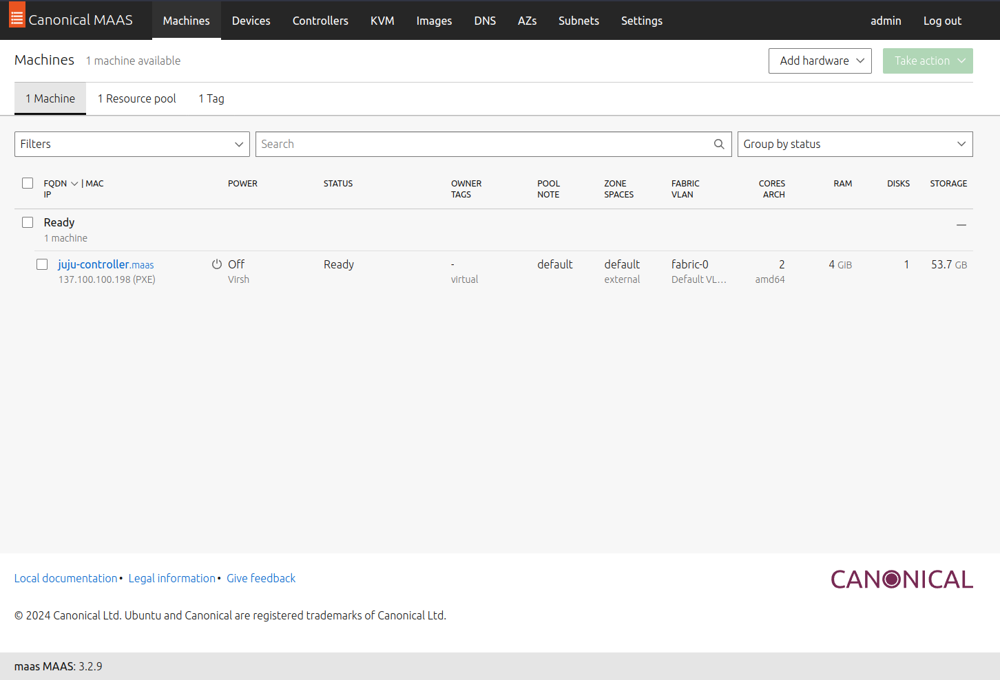

Repeat the steps for the remaining machines and make user machine is now `ready`

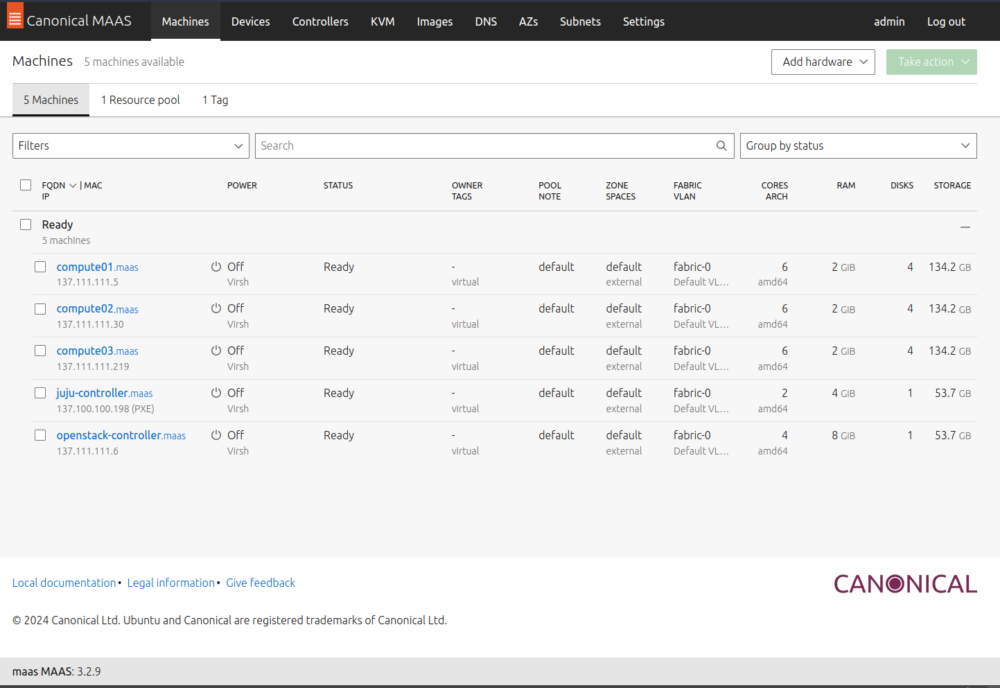

## Config commissioned machine

Click the machine, start from `juju-controller`. Go to tab `Network`, Action choose `Edit physical`.

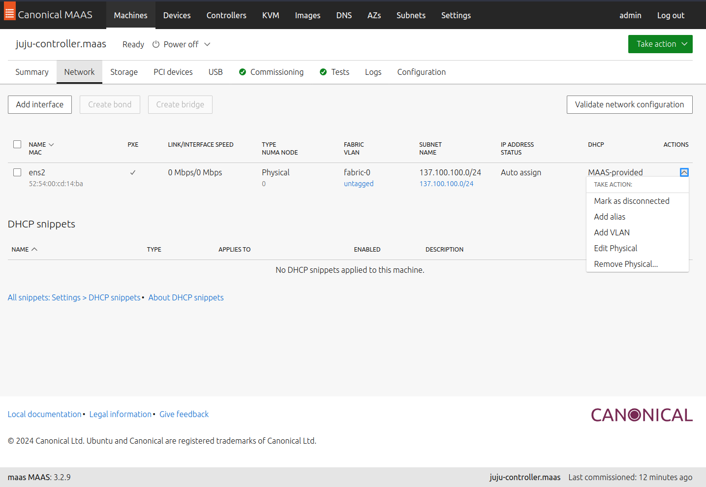

Change ip mode to `Static assign`, then give the ip based on specs.

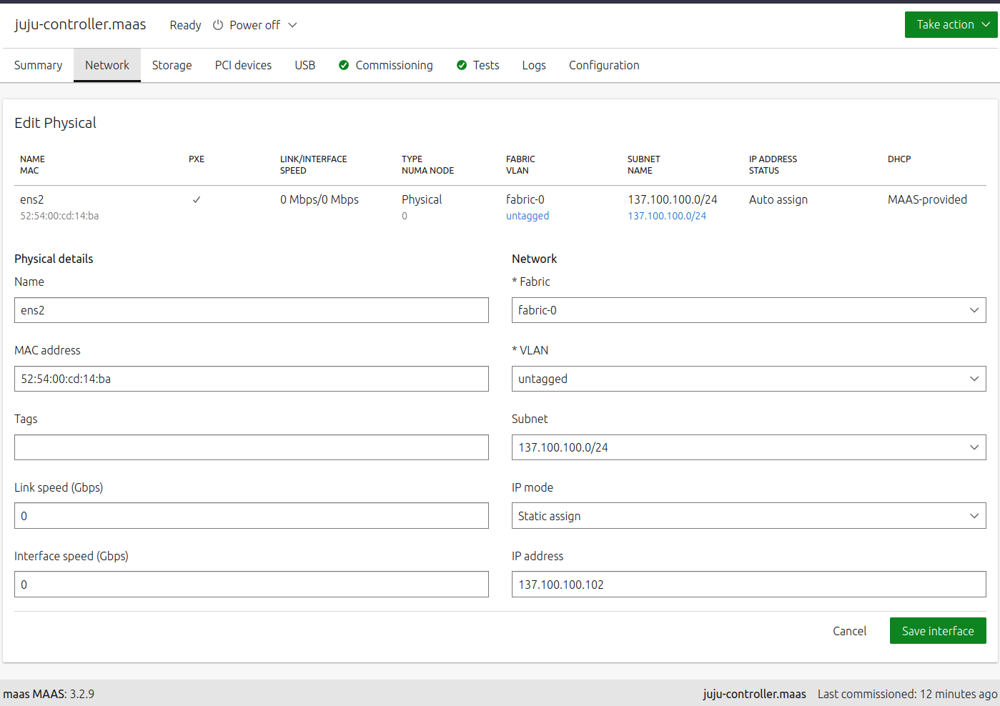

Next, go to `configuration` tab. Edit the tags, create tag `juju-controller`.

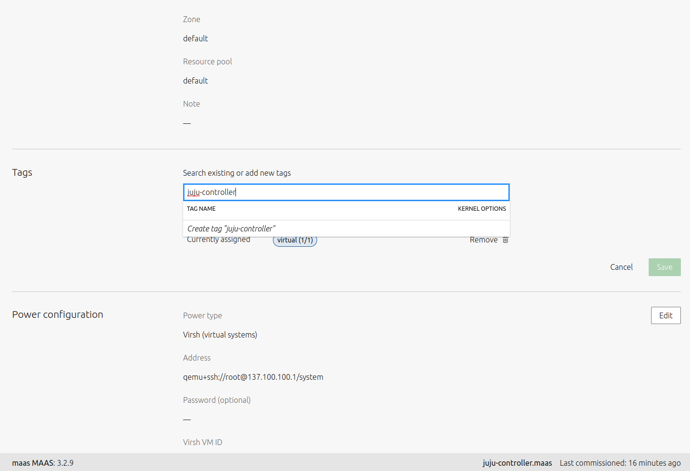

Save

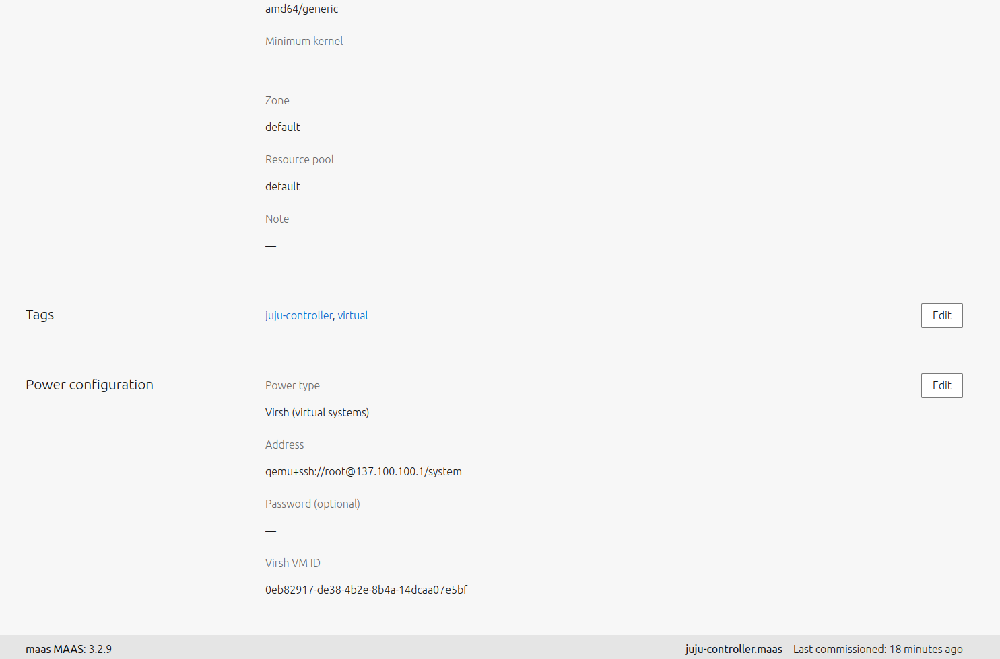

Do same steps for `openstack-controller` machine.

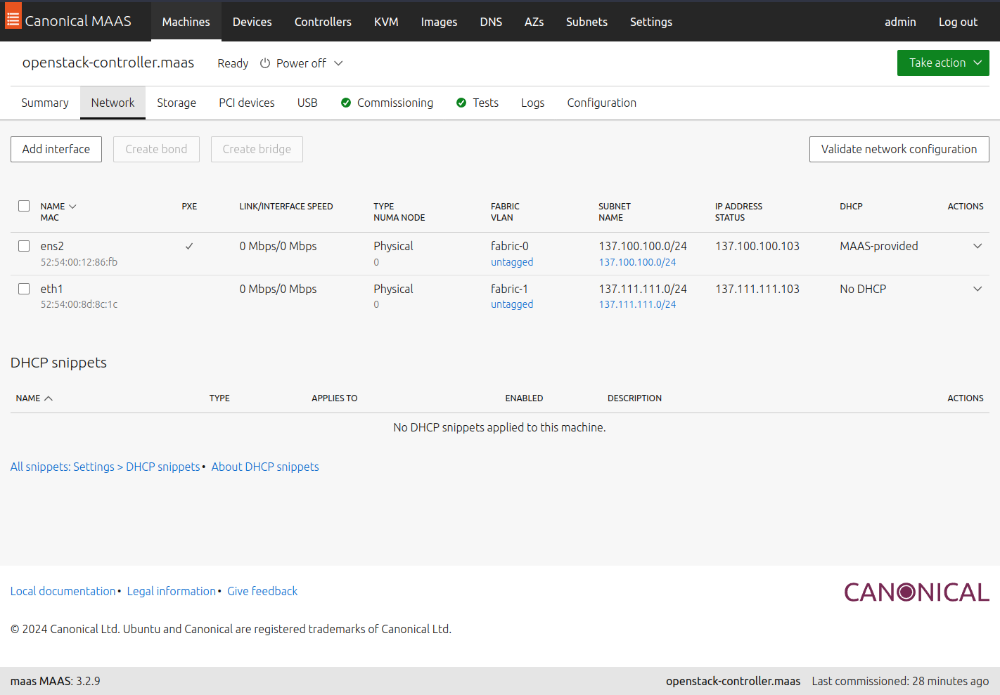

For all compute machine, need to add vlan `1337` to `fabric-0` interface.

compute01

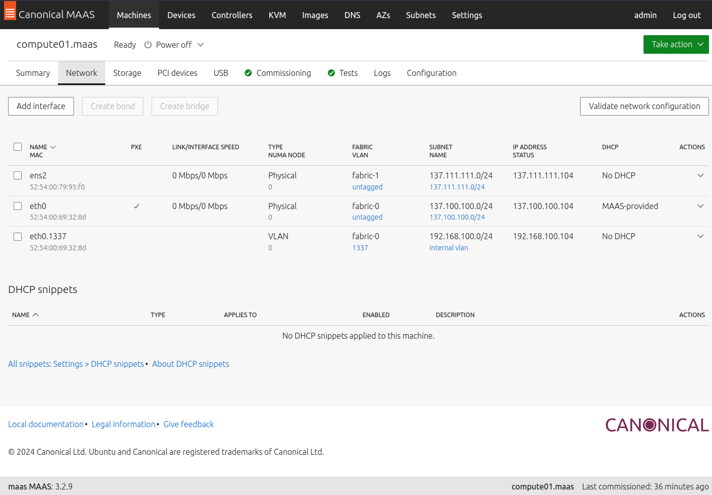

compute02

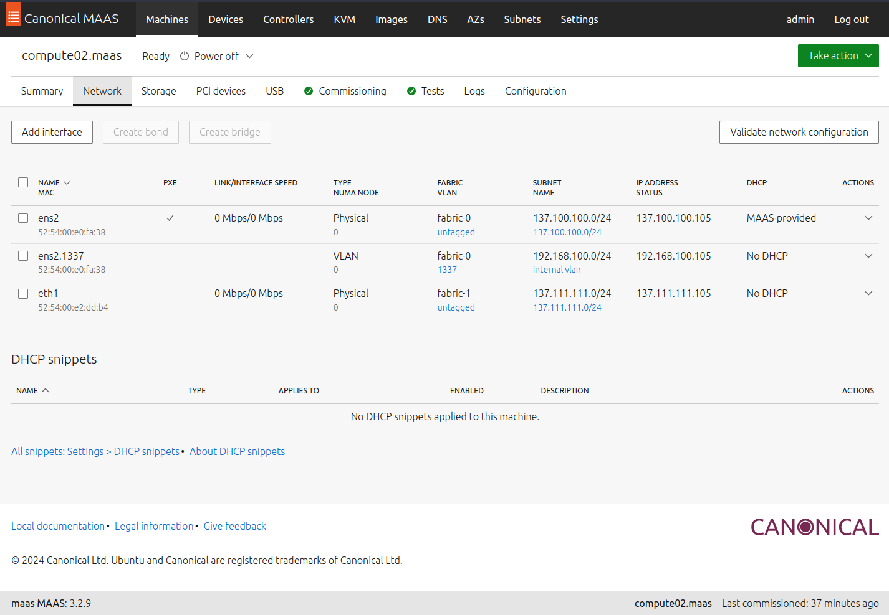

compute03

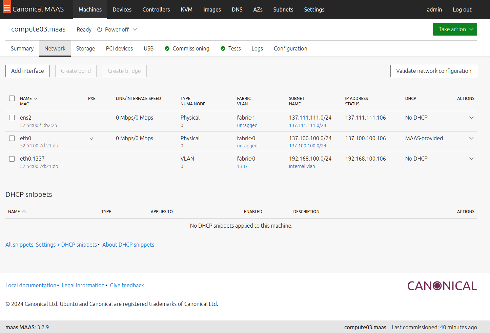

Now, all machine is ready and confogured.

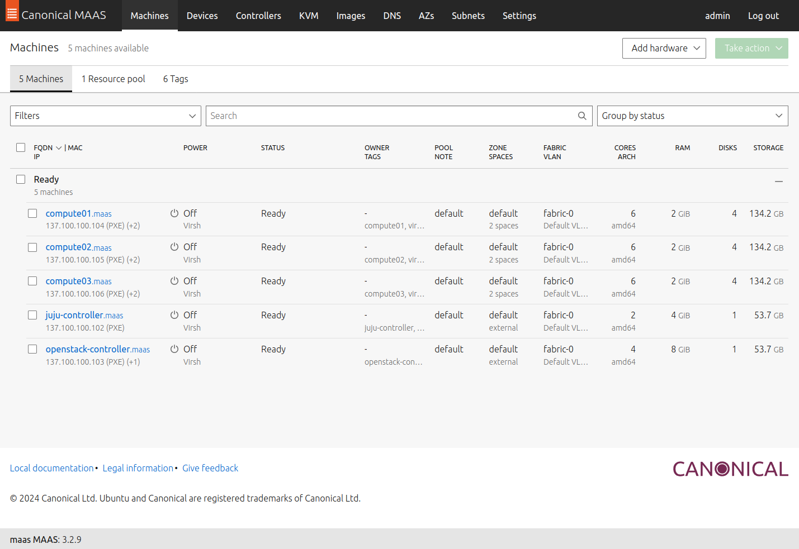

Next, setup juju controller

[Next Step](setup-juju-controller.md)