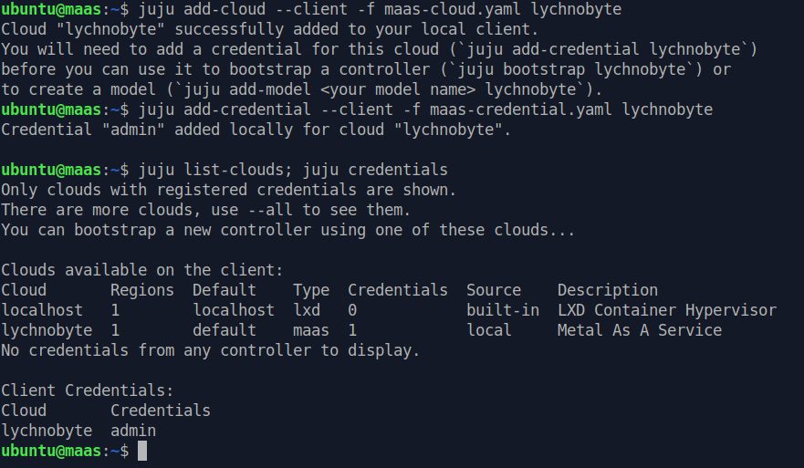
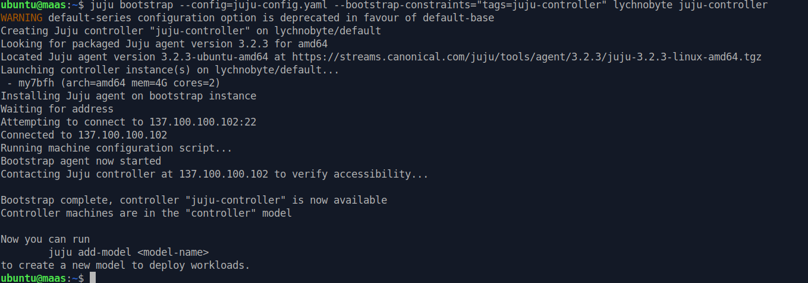
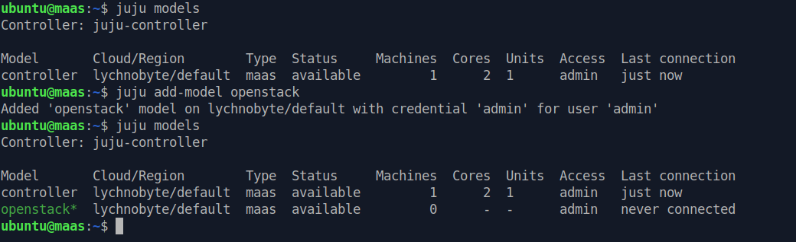
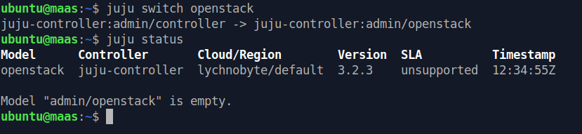
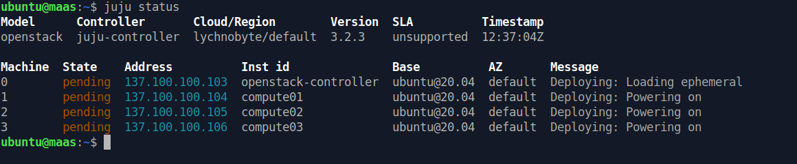
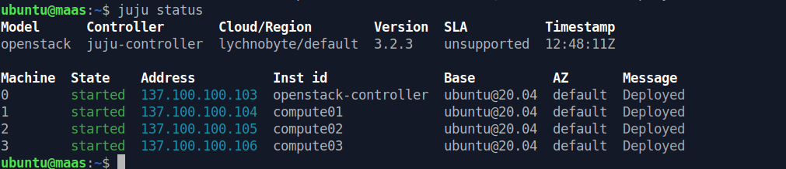

# Setup Juju controller

All command exec as `ubuntu` user

## Setup juju client
Download and install juju client

```
curl -LO https://launchpad.net/juju/3.2/3.2.3/+download/juju-3.2.3-linux-amd64.tar.xz
tar xf juju-*.tar.xz
sudo install -o root -g root -m 0755 juju /usr/local/bin/juju; rm juju
sudo install -o root -g root -m 0755 juju-metadata /usr/local/bin/juju-metadata; rm juju-metadata
```

## Add MAAS Credentials to juju client
Create maas credentials for juju clients

```
cat << EOF > maas-cloud.yaml
clouds:
  lychnobyte: // Change here for cloud name
    type: maas
    auth-types: [oauth1]
    endpoint: http://137.100.100.101:5240/MAAS
EOF

cat << EOF > maas-credential.yaml
credentials:
  lychnobyte: // Change here for cloud name
    admin:
      auth-type: oauth1
      maas-oauth: $(sudo maas apikey --username=admin)
EOF
```

Add maas credentials to juju client

```
# Example:
juju add-cloud --client -f maas-cloud.yaml CLOUD_NAME
juju add-credential --client -f maas-credential.yaml CLOUD_NAME 
juju list-clouds; juju credentials

juju add-cloud --client -f maas-cloud.yaml lychnobyte
juju add-credential --client -f maas-credential.yaml lychnobyte
juju list-clouds; juju credentials
```

Result like this

<details>


</details>

## Juju Bootstrap
Create configuration for juju to bootstrap controller

```
cat << 'EOF' > juju-config.yaml
default-series: focal
default-space: external
juju-ha-space: external
juju-mgmt-space: external
EOF
```

Bootstrap juju controller (+- 5 mins)

```
# Example:
juju bootstrap --config=juju-config.yaml \
--bootstrap-constraints="tags=juju-controller" \
CLOUD_NAME CONTROLLER_NAME

juju bootstrap --config=juju-config.yaml --bootstrap-constraints="tags=juju-controller" lychnobyte juju-controller
```

After bootstrap success.

<details>


</details>

## Juju model
Add new model `openstack` to juju

```
juju models
juju add-model openstack
juju models
```

<details>


</details>

## Add machine to Juju model

Add machine from maas to juju model `openstack`.

Switch to `openstack` model then check status, should be empty

```
juju switch openstack
juju status
```

<details>


</details>

Now, add the machines using tags and wait for juju agents installed on the machines

```
juju add-machine --base ubuntu@20.04 --constraints="tags=openstack-controller"
juju add-machine --base ubuntu@20.04 --constraints="tags=compute01"
juju add-machine --base ubuntu@20.04 --constraints="tags=compute02"
juju add-machine --base ubuntu@20.04 --constraints="tags=compute03"
```

<details><summary>wait process</summary>


</details>

<details><summary>all machines deployed</summary>


</details>

Next, setup deploy `openstack` to juju

[Next Step](../../application-bundle/)